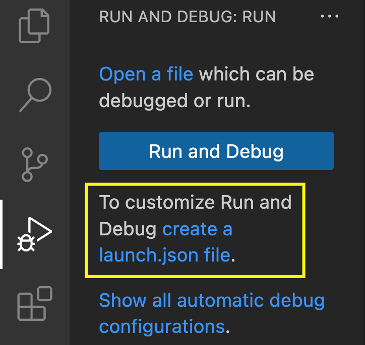
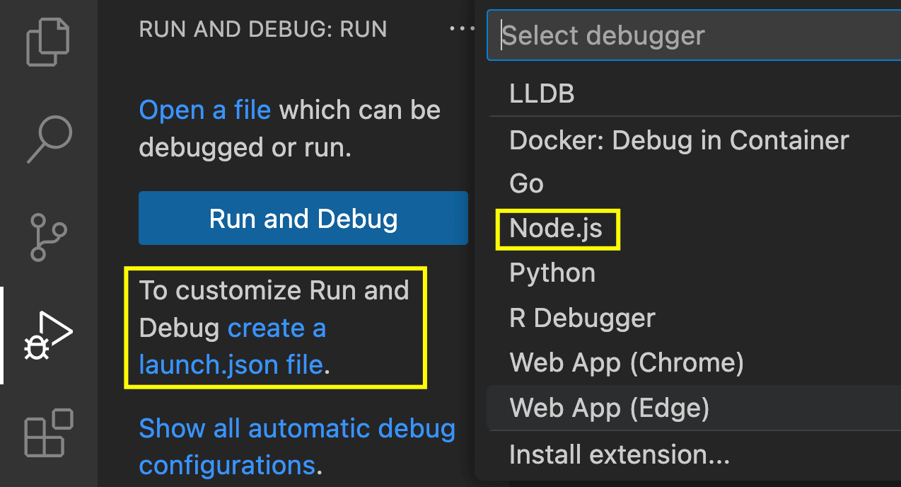

# Pre-requisitos

- Tener instalado node.
- Tener instalado algún **package manager**: [`npm`](https://www.npmjs.com/), [`yarn`](https://yarnpkg.com/), [`pnpm`](https://pnpm.io/)

# Instalación

Los comandos a listar son con `npm` (pero puede usar algún otro package manager)

```bash
npm install
```

Verificando la versión instalada de Typescript

```bash
npx tsc -v
```

## NPX

`npx` (Node Package Execute) viene con `npm` (si tienes una versión mayor a la 5.2.0).

Es un ejecutor de paquetes `npm` que puede ejecutar cualquier paquete que desee desde el registro `npm` sin siquiera instalar ese paquete.

- `npm` es una herramienta usada para instalar paquetes.
- `npx` es una herramienta usada para ejecutar paquetes.

## Instalación global de Typescript

⚠️ En caso desee instalar typescript de manera global:

```bash
npm install -g typescript
```

Verificando versión instalada

```bash
tsc -v
```

# Generando tsconfig.json

Ejecutar el siguiente comando:

```bash
npx tsc -init
```

## Opciones activadas en tsconfig:

Dentro de las líneas del archivo tsconfig, activar las siguientes:

```json
/* Modules */
"rootDir": "./src",

/* Emit */
"outDir": "./dist",
"removeComments": true,
```

# Experimentación

Ya no será necesario mapear cada archivo, ahora bastará ejecutar `npx tsc`:

```bash
npx tsc
```

Para ejecutar el archivo javascript generado:

```bash
node dist/index.js
```

# Tarea: configurar Debug en VScode

Para poder realizar el debug en VSCode necesitamos hacer 2 configuraciones:

1. Crear el archivo launch.json desde `Run & Debug` de VSCode.
2. Habilitar un parámetro en `tsconfig.json`.

## Punto 1: launch.json

El archivo `.vscode/launch.json` se genera en la opción `Run & Debug` seleccionando :

1. Create a launch.json file desde `Run & Debug`
2. Select debugger: Node.js

Los 2 pasos mencionados en imágenes:

Creación de `launch.json` personalizado:


Debugger en `Node.js`:


Finalmente en el archivo `.vscode/launch.json` agregar la siguiente línea:

```json
"preLaunchTask": "tsc: build - tsconfig.json"
```

Finalmente el archivo `.vscode/launch.json` quedará de la siguiente manera:

```json
{
    // Use IntelliSense to learn about possible attributes.
    // Hover to view descriptions of existing attributes.
    // For more information, visit: https://go.microsoft.com/fwlink/?linkid=830387
    "version": "0.2.0",
    "configurations": [
        {
            "type": "node",
            "request": "launch",
            "name": "Launch Program",
            "skipFiles": [
                "<node_internals>/**"
            ],
            "program": "${file}",
            "preLaunchTask": "tsc: build - tsconfig.json"
        }
    ]
}
```

## Punto 2: parámetro en tsconfig.json

Es la tarea del presente repositorio. Investigar el parámetro que se necesita activar para que el debug en VSCode funcione.

[Aquí puedes verificar la solución a esta tarea, recuerda primero intentar](https://github.com/silabuzinc/step1-sol-ts)